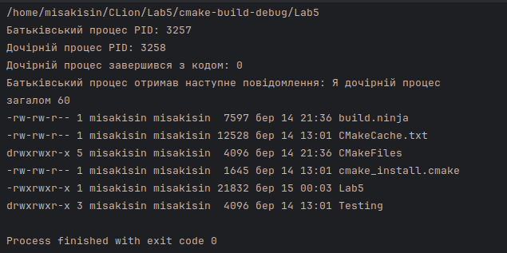

<h1 align="center">Лабораторна робота №5</h1>
Тема: Створення процесу. Керування виконанням. Використання системного виклику exec. Мультипроцесова комунікація  
Виконав: Федотов Євгеній Євгенович  
Прийняв: Дребезов Денис Олегович  
Група 6.1221
<h3>Умова завдання:</h3>
Створення процесу:

    Напишіть програму, яка використовує системний виклик fork для створення нового процесу.
    Виведіть PID для обох процесів та повідомлення про їхній статус (батьківський чи дочірній).

Керування виконанням:

    Розширте попередню програму так, щоб батьківський процес чекав завершення дочірнього процесу за допомогою системного виклику wait.
    Виведіть повідомлення про завершення дочірнього процесу та код завершення.

Використання системного виклику exec:

    Створіть програму, яка використовує системний виклик exec для виконання іншої програми.
    Розгляньте використання різних функцій exec та зробіть порівняння їх використання.

Мультипроцесова комунікація:

    Створіть батьківський та дочірній процеси.
    Використайте спільний розділ пам'яті для обміну даними між процесами.
<h3>Результат виконання:</h3>

